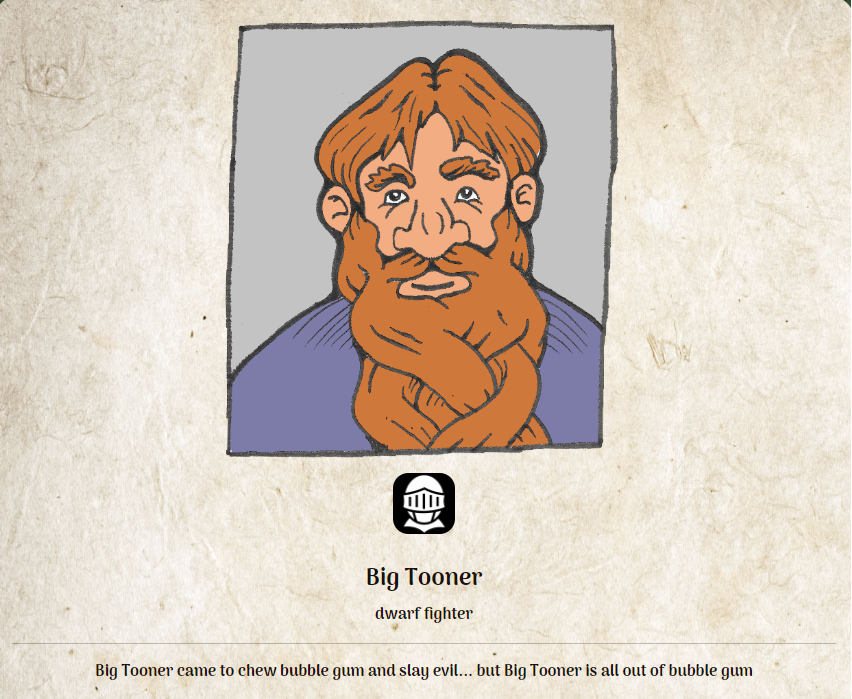

# CodingNKobolds

A fantasy avatar creator that allows the user to customize their avatar for whatever campaign they are about to embark on. This is a project for UW Wisconsin Full Stack Coding Boot Camp, Collaborations are welcome. If you would like to Collaborate or just want to check out the code more in-depth feel free to clone/fork the repo, we have included an "env" file, please rename this file to ".env" and enter you credentials for MySQL in the appropriate areas.

===============================
 
### App Details:
  
*A full-stack application that creates fantasy character/characters

*When the User starts the application they are presented with a choice to login or create a new account

*When the user chooses to sign-up they presented with a form to submit a unique username and password

*When the user chooses to login they are presented with a form to submit their unique credentials

*When the user is logged in successfully they are presented with a user-page that displays all of their created characters, images that represent the characters along with their unique details, an option to create a new character, an option to delete a character, or to logout

*When the user chooses to add a new character they are presented with a form to enter the character name, race, gender, class, and backstory

*When the user creates a new character they are able to view the newly created character along with all of their previously created characters

*When the user chooses to edit or delete a character they are presented with a form to update character name, race, gender, class and backstory along with an option to delete the character permanently 

 
===============================
 
 
#### Link to Deployed Application on Heroku:

 https://codingnkobolds.herokuapp.com/

 

===============================

### Link to GitHub Repository:

 https://github.com/woodb58/coding-n-kobolds
 
===============================
 
### Creator Profile Information:
 
GitHub: [Patrick Archer](https://github.com/patrickarcher414)

GitHub: [Emily Bennet](https://github.com/bennettem)

GitHub: [Cameron Sickler](https://github.com/CameronSickler)

GitHub: [Brian Wood](https://github.com/woodb58)

===============================
 
### Resources:

 NPM    MYSQL   Sequelize   Heroku